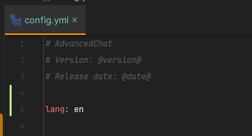

# Languages

### Languages: 

* English en
* German de
* French fr
* Spanish es
* Chinese Simplified zh-cn
* Portugese (Brazil) pt-br
* Korean ko-kr

To change language on your server, edit `plugins/AdvancedChat/config.yml` 

`lang` to your locale (e.g. zh-cn) and run `/am reload` command.
