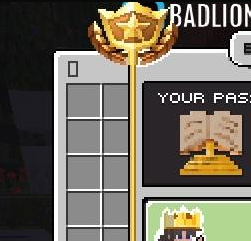

# Install Custom UIs

<mark style="color:yellow;">You must have</mark> [<mark style="color:yellow;">**ItemsAdder**</mark>](https://www.spigotmc.org/resources/%E2%9C%A8itemsadder%E2%AD%90emotes-mobs-items-armors-hud-gui-emojis-blocks-wings-hats-liquids.73355/) <mark style="color:yellow;">**or**</mark> [<mark style="color:yellow;">**Oraxen**</mark> ](https://www.spigotmc.org/resources/%E2%98%84%EF%B8%8F-oraxen-custom-items-blocks-emotes-furniture-resourcepack-and-gui-1-18-1-21-4.72448/)<mark style="color:yellow;">installed and working properly before proceeding with these steps.</mark>

## Available UIs

Currently, 4 UI packs are available for our plugins:

<table data-card-size="large" data-view="cards"><thead><tr><th></th><th></th><th data-hidden data-card-cover data-type="files"></th><th data-hidden data-card-target data-type="content-ref"></th></tr></thead><tbody><tr><td><strong>Immersive BattlePass UI</strong></td><td>Immersive new drag &#x26; drop UI graphics solution for BattlePass plugin</td><td><a href="../.gitbook/assets/gui-expanded (1).gif">gui-expanded (1).gif</a></td><td><a href="https://advancedplugins.net/item/110">https://advancedplugins.net/item/110</a></td></tr><tr><td><strong>AdvancedEnchantments UI</strong></td><td>Amaze and surprise your server players with new immersive experience</td><td><a href="../.gitbook/assets/gui-expanded (2).gif">gui-expanded (2).gif</a></td><td><a href="https://advancedplugins.net/item/AdvancedEnchantments-UI.123">https://advancedplugins.net/item/AdvancedEnchantments-UI.123</a></td></tr><tr><td><strong>AdvancedPets UI</strong></td><td>Complete the full unique experience of custom pets with this immersive UI upgrade</td><td><a href="../.gitbook/assets/gui-expanded.gif">gui-expanded.gif</a></td><td><a href="https://advancedplugins.net/item/AdvancedPets-UI.137">https://advancedplugins.net/item/AdvancedPets-UI.137</a></td></tr><tr><td><strong>AdvancedJobs UI</strong></td><td>Improve your players' experience with the new ultimate AdvancedJobs UI</td><td><a href="../.gitbook/assets/ezgif-4-bdf180f0aa.gif">ezgif-4-bdf180f0aa.gif</a></td><td><a href="https://advancedplugins.net/item/AdvancedJobs-UI.189">https://advancedplugins.net/item/AdvancedJobs-UI.189</a></td></tr></tbody></table>

## Video Guide

We now have a YouTube video guide available on installing our UIs using ItemsAdder and Oraxen:



Using timestamps navigate between ItemsAdder (starts 0:27s) and Oraxen installations (Oraxen starts 2:25s).

The process explained in this video is the same for all UIs we have and you can follow this guide to install UIs with any of our offered packs.

## Text Guide

### For ItemsAdder

1. Copy the "ItemsAdder" folder from the Configurations folder into the "plugins" folder of your server.
2. In-game, run the "/iareload" and "/iazip" commands.
3. Open "\<Plugin name> Config (For ItemsAdder)" in the downloaded file _(E.g. "BattlePass Config (for ItemsAdder")_
4. Replace all contents of the Plugin's folder with the contents of the "\<Plugin name> Config (For ItemsAdder)" folder.
5. Restart your server

### For Oraxen

1. Copy the "Oraxen" folder from the Configurations folder into the "plugins" folder of your server.
2. In-game, run the "/oraxen reload all" command
3. Open "\<Plugin name> Config (For Oraxen)" in the downloaded file _(E.g. "BattlePass Config (for_ Oraxen\_")\_
4. Replace all contents of the Plugin's folder with the contents of the "\<Plugin name> Config (For Oraxen)" folder.
5. Restart your server

## Common Problems

Help! My plugin GUI is full of gold nuggets

You have not installed or loaded the texture pack correctly yet! Make sure you added files in the ItemsAdder/Oraxen folder, then:\
\- For ItemsAdder run /iareload and /iazip commands\
\- For **Oraxen** run /oraxen reload all\
Restart your server and the UIs will be installed!

My GUI is offset

If your GUI is offset like this and you are using Oraxen, you have not installed `glyphs` file's `shifts.yml` file correctly. Make sure you go into `/plugins/Oraxen/glyphs` and install the shifts.yml file from the pack. Make sure it overrides the file, as sometimes that is the problem. Afterwards restart.

I can't get it to work at all

Contact us on discord https://advancedplugins.net/discord and we will help you out ASAP.

