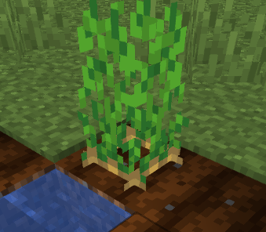

# Harvesting Crops

Crop block types have changed since 1.15. We're going to be explaining how to set up harvest quests using `block-break` quest.&#x20;

## Crops Names

First off, new crop block names are ([find full list of materials here](https://hub.spigotmc.org/javadocs/bukkit/org/bukkit/Material.html)):

<table><thead><tr><th width="249.33333333333331"></th><th></th><th>States (Min-Max)</th></tr></thead><tbody><tr><td>Beetroots</td><td>BEETROOTS</td><td>0-3</td></tr><tr><td>Carrot</td><td>CARROT</td><td>0-7</td></tr><tr><td>Chorus Flower</td><td>CHORUS_FLOWER</td><td>0-5</td></tr><tr><td>Wheat</td><td>WHEAT</td><td>0-7</td></tr><tr><td>Nether Wart</td><td>NETHER_WART</td><td>0-3</td></tr><tr><td>Potatoes</td><td>POTATOES</td><td>0-7</td></tr></tbody></table>


## States

Now, most crops have states. All crops listed above do have grow states.&#x20;

States: 0-7, 0 being when crop is just planted, 7 is when crop is fully grown. Examples:

### State 0 (Just Planted):

.png>)


### State 7 (Fully Grown):



## Quest Examples

### Example #1

With this example, you are required to break 10 fully grown potato plants

```yaml
quests:
  1:
    name: 'Daily - Farmer' 
    type: harvest-crops
    variable: potatoes
    required-progress: 10 
    points: 10 
    item: 
      material: diamond_pickaxe:0
      amount: 1
      name: '&eFarmer'
      lore:
        - '&7Mine &e10 Potatoes'
        - ''
        - '&7Progress &e%total_progress%&7/&e%required_progress%'
```

### Example #2

In this example, we're harvesting 10 of fully grown nether warts. Since it's maximum age state is 3, for fully grown nether warts we're using `nether_wart:3`

<pre class="language-yaml"><code class="lang-yaml">quests:
  1:
    name: 'Daily - Farmer' 
   type: block-break
<strong>    variable: potatoes{age: 7}
</strong>    required-progress: 10 
    points: 10 
    item: 
      material: nether_wart:0
      amount: 1
      name: '&#x26;eFarmer'
      lore:
        - '&#x26;7Mine &#x26;e10 Nether Warts'
        - ''
        - '&#x26;7Progress &#x26;e%total_progress%&#x26;7/&#x26;e%required_progress%'
</code></pre>

