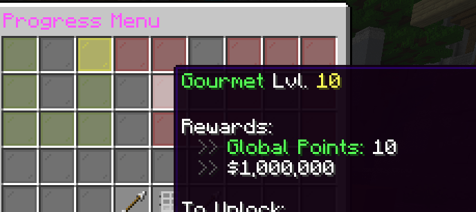

# 💰 Per-Level Rewards

Per-level rewards are rewards that are given for a specific level, once it's completed. Usually these are special levels where custom reward is assigned, not one with formulas, for example item rewards.

## How to set up per-level rewards

First off, the reward must be made in the `rewards.yml` file, and you must know the ID of it. To make a reward, follow the [rewards-guide.md](rewards-guide.md "mention") tutorial.

For this example, we've made a reward that gives 1 million $.


```yaml
'million': # The id of the reward
  type: command
  name: '$1,000,000'
  commands:
    - 'eco give %player% 1000000'
```


Once our reward is made, we now open our jobs file. The jobs files are located in `plugins/AdvancedJobs/jobs` folder.&#x20;

Locate `level-rewards` line. Now we'll set up level 10 to give a reward by id `million`


```yaml
# levels info
level-rewards:
  10: 
    - million
```


That is it! You will now need to reload the plugin using `/ajadmin reload`, and your reward will be present for level 10 of the job in progress menu:

<figure><figcaption></figcaption></figure>
